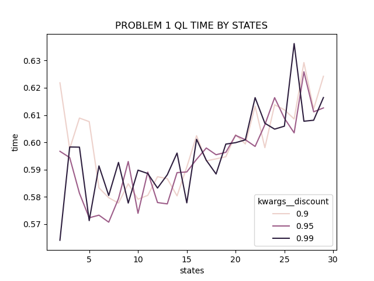
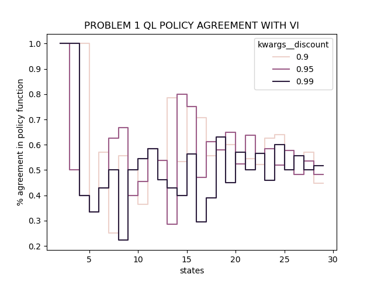
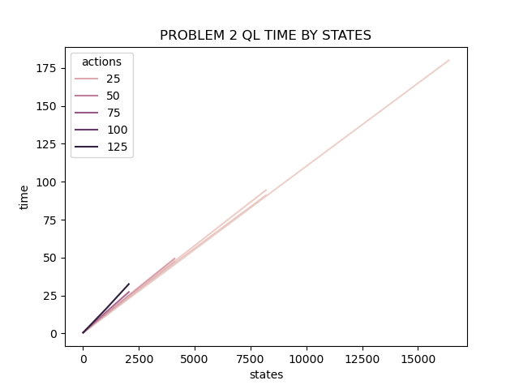
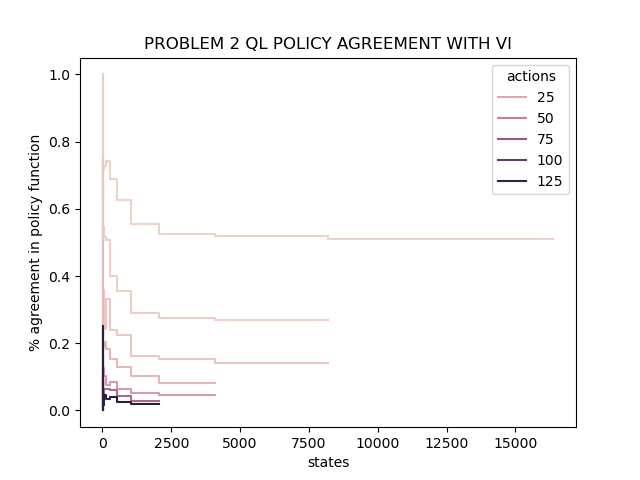
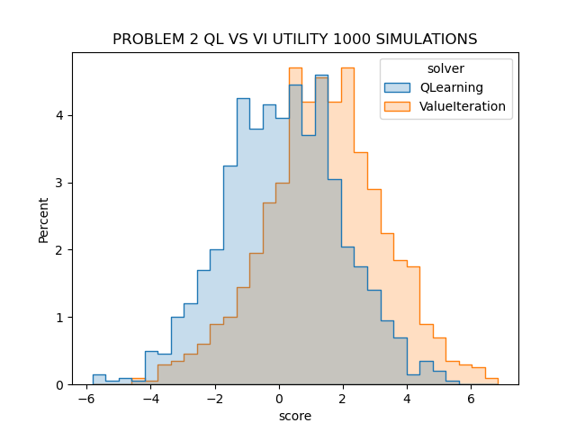

##### CS 7641 - Assignment 4 - Joshua Ruf (jruf6)

#### MDP Problems

##### Problem 1: Forest Management

This problem involves balancing the tradeoffs in managing a forest and is found in the examples module of the [pymdptoolbox](https://pymdptoolbox.readthedocs.io/en/latest/api/example.html#mdptoolbox.example.forest) python package. The agent aims to *(a)* maintain an old forest ecosystem for wildlife, and *(b)* profit from logging. In the "game" the agent has two actions: {*Wait*, *Cut*} and this action applies to the entire forest (not tree by tree). Each state is an age of the forest. The rewards work as follows: if the forest is Cut when the forest is in the oldest state then the reward is 2, if the forest is not cut in the oldest state then the reward is 4. As well, when the forest is cut in any other state than the oldest state and the youngest state the reward is 1. The tricky part of the problem is that in each period there is some probability that the forest will burn down, in which case the reward is 0.

This problem is interesting because the number of actions is fixed at two while states can increase infinitely. However, the probability of reaching the oldest forest state approaches zero as the number of states increases. So this problem likely only has a solution for a "reasonable" number of states, to be determined how many states constitutes reasonable. Interestingly, the idea of a "best state" here doesn't apply as obviously the oldest state is optimal, the important question involves the optimal policy to weigh waiting for that state and the potential risk of fire.

##### Problem 2: Random Markov Process

This problem represents generating a random transition probability matrix, and a random reward matrix. It is found in the examples module of [pymdptoolbox](https://pymdptoolbox.readthedocs.io/en/latest/api/example.html#mdptoolbox.example.rand) as well. Because these matrixes are entirely randomized, it's hard to imagine that an optimal policy exists that well-outperforms other policies. That said, this problem involves varying both the number of actions and the number of states and as such gives way to more complicated problems.

#### Value Iteration

Value iteration convergence is reached when the change in the value function between iterations is less than 0.01. If this condition is not met, then the algorithm will terminate after 1000 iterations (at least for this implementation).

##### Problem 1

Because of the simple environment for this problem, convergence was reached for all number of states tried, as well as three different discount factors (0.9, 0.95, 0.99). Unsurprisingly, more iterations are required for the value function to converge, given the same number of states. This is because the future is more valuable when the discount rate is higher, and as such, more of it need to be explored. Interesting to note here is the exponential growth in the number of iterations as a function of number of states: between 2 and roughly 10 states the number of iterations grows linearly, however beyond that point (until convergence) the number of iterations explodes. This shows the limitations of value iteration in that it requires (at least in the limit) to visit each state infinitely often to converge to a global optimum, obviously as more states are added this becomes more difficult. Still, this problem is relatively easy to solve because there are only two actions regardless of the number of states.

This second plot that looks at time to converge by number of states should be taken with a grain of salt since the time represents just a single run. However, the relationship between time and states does not appear to be as exponential in number of states as does the relationship between iterations and state. The 0.99 discount factor curve does exhibit an explosion at roughly state 18, however before then it's quite linear. This is likely because each iteration is relatively cheap and still there is not a huge number of states.

This figure requires some explanation, but it compares how the value function changes over the each state, comparing across different state lengths. The idea is that the best state is obviously the max age, because then we can either wait (reward of 4) or cut (reward of 2), a decision driven by the probability of forest fire (in which case the reward is 0). The question becomes, how quickly does the value function's value decrease as we move away from the optimal state/value pair?

Thinking about the simplest case with only two states: *cleared forest* and *fully grown forest*, the curve is a straight line. As we add more states, transitionary states become available between cleared and fully grown and as such the line turns into more of a curve. This is because of the dynamics of our world. For example, state 5 is very valuable if there are only 5 states while it is not very valuable if there are 50 states because the probability of reaching state 50 without a fire approaches zero. The result is that when the number of total states gets large, there is no attempt to reach the oldest state but rather just cut down whenever possible. This is shown by the dark lines that refer to larger total number of states, where the value function values hover at around 0.3 in early states. Meanwhile, for smaller total number of states it is possible to reach the oldest state so the new growth states hover around 0.2, accepting waiting early on in order to reach the final state.

##### Problem 2

Note: to focus on the addition of varying number of actions, all run with discount rate of 0.95.

In the second MDP problem, number of iterations appears to be more a function of the number of actions as opposed to the number of states. In this figure we see that the largest number of iterations is actually spent on problems that have few states but many actions. This is surprising to me, but I can rationalize it with the following logic: perhaps with few states and a lot of actions the value functions are relatively constant over iterations as the difference of being in state 1 vs state 2 is overshadowed by the difference in choosing some action in either state. I also thought about whether or not the learning rate, epsilon, might need to be adjusted in response to different MDPs. Maybe as the world gets more complicated it's easier to stumble into some region in which the improvements fall below the epsilon threshold. As well, because the transition matrix and reward matrix are chosen at random, it could be the case that the distribution used gives way to some outlier action-state combinations that are clearly optimal. Unlikely yes, but I suppose possible.

In this figure, we see that at low number of actions, the relationship between states and time is somewhat linear, but as actions are increased this relationship becomes more and more convex. Especially the problem with the largest number of actions, 128, the time curve just shoots upwards almost immediately. What I'm having a hard time wrapping my head around is why medium actions and medium states would take so much less time than many actions and few states. Both combinations represent varying levels of world complexity, but it appears actions carry more importance than states (at least for this narrowly defined problem).

Considering the figures above, an explanation could be that the solutions are simply not good, despite the fact that convergence has been reached. On the one hand I understand value iteration to reach a global optimum, but on the other hand it requires visiting each state infinitely often and for larger problems this isn't possible (especially on my MacBook). That said, looking at the solutions to the various MDP state-action combinations, all combinations converge to the epsilon optimum policy.

#### Policy Iteration

##### Problem 1

Policy iteration requires fewer iterations than value iteration to solve problem 1, across all states and discount factors. As well, the number of iterations is linear in the number of states rather than exponential as seen in value iteration.

In the time domain however, policy iteration is noticeably slower (at times exceeding double the time) required for value iteration. This is likely because of the nested iterative approach of policy iteration, alternating between exploration of new policies and exploitation of known policies. Interestingly, the time jumps most at smaller number of states, and levels off at about 9 states. This is the opposite relationship to value iteration which only slowed down noticeably at a higher number of states. Clearly, at the beginning policy iteration benefits greatly from exploring several policies and pursuing those that are fruitful.

Looking at how the value function's values changes as we move from the oldest state, we see that policy iteration does not decrease as much as we move from the optimal/oldest state. Why might that be? I think this is because policy iteration doesn't care about the values of value function per se. All it cares about is the relative ordering of the policies. This is akin to using regression probabilities for a classification problem, we choose the class that has the highest probability without caring about the specific value of the probability. Ultimately we only care about the ranking of states' values rather than the values themselves.

I sought to verify this by comparing the policies across value and policy iteration and they are identical.

##### Problem 2

Policy iteration seems to have no problem reaching optimal solutions in few iterations. Even in the situations that gave value iteration trouble: large number of actions and few states policy iteration converges in less than 8 iterations for all combinations tested. This could be a quirk of the randomization, and in practice one should repeat these experiments with a variety of starting positions and transition/reward matrices.

The tradeoff for fewer number of iterations for policy iteration convergence is that more computation is done in each iteration, making them take longer. We see this in the following figure, where the MDP with the largest number of states takes close to a minute to find an optimal solution.

Interestingly, in this problem there is a setup that results in value iteration and policy iteration arriving at different conclusions. When there are 32 states and 2 actions the two solvers are not in line. Since this setup with 32 states and 2 actions is relatively small, this gives reason to believe that other situations like this are possible. That said, the two solvers do agree on the best state and also on which policy to take in the best state. The correlation between the value function is also equal to 1. To me, this goes to show that in a complicated enough environment as a large MDP it could be the case that there are multiple policies that are very comparable in terms of overall utility.

#### Another RL Approach

Enter Q-Learning, a "model-free" RL approach. That might seem strange in this context since we do have access to the model (the transition and reward matrices) but we can proceed as if this were not the case. Based on my understanding, in value iteration and policy iteration the agent receives a full description of the "world" and builds the solution on top of that information. Meanwhile, for Q-learning, the agent need not know the full specification of transitions and rewards, and instead only accesses that information on an "as-needed" basis. This process would work something like this, the agent, in its exploration, decides to take action *a* to go from state *s* to state *s'*. Only at this point does it access the reward associated with this decision. Thinking about this approach in the context of the course's first two thirds, one can consider Q-learning a kind of lazy algorithm, whereas value and policy iteration are more eager.

This result actually has pretty substantial implications for our ability to solve complicated problems. As I've already experienced, a fully specified MDP problem with 4096 states and 32 actions creates a transition matrix taking up roughly 8GB of RAM (and another 8GB for the reward matrix). As such, solving the MDP process without first defining all the information in full could allow us to solve larger problems without running into space constraints, provided the time complexity is manageable. Thinking about why this approach would work, I suppose with value and policy iteration, we're potentially providing the agent with useless information: why should it care about a specific state-action-state pair if it occurs with zero probability? Alternatively, some state-action-state pairs could be strictly worse than others and need not be considered for that reason.

##### Problem 1

Solving the forest management MDP with Q-learning, we see a roughly linear relationship with time, at least for relatively few number of states. Now, there is a caveat, [this particular implementation of Q-learning](https://pymdptoolbox.readthedocs.io/en/latest/api/mdp.html#mdptoolbox.mdp.QLearning) does not support early stopping criteria and as such each MDP setup uses the same 100,000 iterations. Approaches could include something as simple as stopping when the Q table stops changing greater than some threshold, a similar approach to value iteration. Interestingly, the discount factor does not play into how much time is spent, likely because of the model-free sampling approach.

With that, does Q-learning perform as well as value iteration? In short, no not exactly. The figure below plots the difference between the policy function from value iteration and Q-learning, expressed as the percentage of the policy function that is the same between value iteration and Q-learning. As seen, for a low number of states the policies are identical, but as the number of states increases the policies start to diverge, ultimately converging at about 50% similarity.

##### Problem 2

The second problem involves the large randomly generated transition and reward matrices. Q-learning took MUCH longer to solve these problems, however the time required is linear in the number of states unlike value iteration and policy iteration. Time increases faster for problems with more actions, but still it seems like Q-learning can handle much larger problems without going exponential. But as mentioned above, the number of iterations was fixed going into the problem, and in practice this is another decision that the practitioner needs domain knowledge to determine.

In this problem, the policy functions do not match the value iteration solution very closely. This is shown in the following figure that calculates the percentage agreement in the two policy functions at varying levels of states and actions. Like in the previous example, the agreement declines as the number states or actions increases. For a large number of actions, the agreement is not very close at all.

The question then becomes: has Q-learning been able to find a solution better than value and policy iteration? Well, in these situations explored, no. We have provided these solvers fully specified MDPs and given that they should converge to a global optimum given enough iterations so as to be able to cover all the states. In situations where we did not have a fully specified MDP then Q-learning might serve as an improvement since it could uncover actions that the designer had not considered.

#### Conclusion

Overall, we've explored value iteration and policy iteration under two different MDP setups, and compared these results to Q-learning to offer a model-free approach. This final figure compares the simulated utility values, starting from a random state and following the optimal policy for a MDP with 2048 states and 16 actions. The orange area represents the distribution of scores for value iteration solution while the blue area represents the distribution of scores for Q-learning. Clearly value iteration outperforms Q-learning on average, however I expect this gap to decrease as the number of Q-learning iterations increases.

To my surprise, this hypothesis did not prove true. The simulated utility across 1000 simulations showed that going from 10,000 iterations to 1,000,000 iterations did not change the overall utility substantially.

##### To sumarize:

1. Value and policy iteration achieve similar conclusions, however value iteration does not scale as well as policy iteration as the number of states and actions grows.
2. Discount rate plays a large role in value and policy iteration, as the future needs to be taken more or less seriously. Conversely, Q-learning seems more or less invariant to the discount rate in the situations tried, perhaps because of its unique sampling approach.
3. solving a large MDP takes an incredible amount of memory and computation, so both value and policy iteration can be insufficient to solve complicated problems
4. Q-learning, being model free is less bound by space constraints since the problem does not need to be defined completely, however solutions require a large number of iterations and these are time consuming. That said, the resource complexity, at least for the values tried in this assignment, is somewhat linear as opposed to exponential.
5. In going with a model free approach however, results are worse as determined by a simulation analysis. However, model tuning and more computation could likely close this gap.
6. Testing Q-learning with varying number of iterations did not result in improvement to the policy function, as measured by simulated utility.

